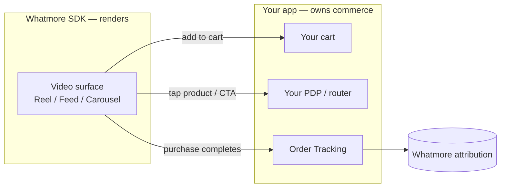

The Whatmore App SDK renders Whatmore's shoppable-video surfaces **natively** inside your
app. It is **commerce-agnostic**: the SDK renders the experience and emits events through a
single delegate / callbacks object — **your app owns the cart, checkout, navigation, and
analytics**. This keeps the integration small; most of the work stays in the
[Whatmore dashboard](https://dashboard.whatmore.live/), not in your codebase.

## Surfaces

The SDK ships ready-to-embed templates that share the same store feed, player, products,
and event model:

| Surface | What it is | Typical placement |
| ------- | ---------- | ----------------- |
| **Reel** | Full-screen vertical swipe (Instagram-Reels style) | a "TV" / "Videos" tab |
| **Feed** | Scrolling post feed | a creator / celebrity page |
| **Carousel** | Autoplaying horizontal rail that opens the Reel | home, category, any screen |

## Platforms

Every platform exposes the **same fingerprint** — the same surfaces, the same configuration
object, the same event delegate, and the same product/event models — so an integration
learned on one platform transfers directly to the others.

| Platform | Package | Status |
| -------- | ------- | ------ |
| **[iOS (Swift)](/integrations/sdk-ios)** | `WhatmoreReels` (Swift Package) | Available |
| **[Android (Kotlin)](/integrations/sdk-android)** | `ai.whatmore:whatmore-reels` (Gradle) | Available |
| **[React Native](/integrations/sdk-react-native)** | `@whatmore-repo/whatmore-reactnative-sdk` | Available |

## The integration model

Every surface takes the **same configuration** (your Whatmore store id + theme) and reports
user actions through the **same event hooks**. You wire those hooks once and reuse them
across surfaces.

- **Configure once** — a store id, optional theme, and a product provider.
- **Handle events** — add-to-cart, product tap, CTA, like/save/share. The SDK never touches
  a cart, so you decide what each event does.
- **Attribute purchases** — capture the products surfaced by the SDK and include them on the
  [Order Tracking](/integrations/order-tracking) call at checkout, so Whatmore can credit the
  video.

Pick your platform for the full interface: **[iOS](/integrations/sdk-ios)** ·
**[Android](/integrations/sdk-android)** · **[React Native](/integrations/sdk-react-native)**.
