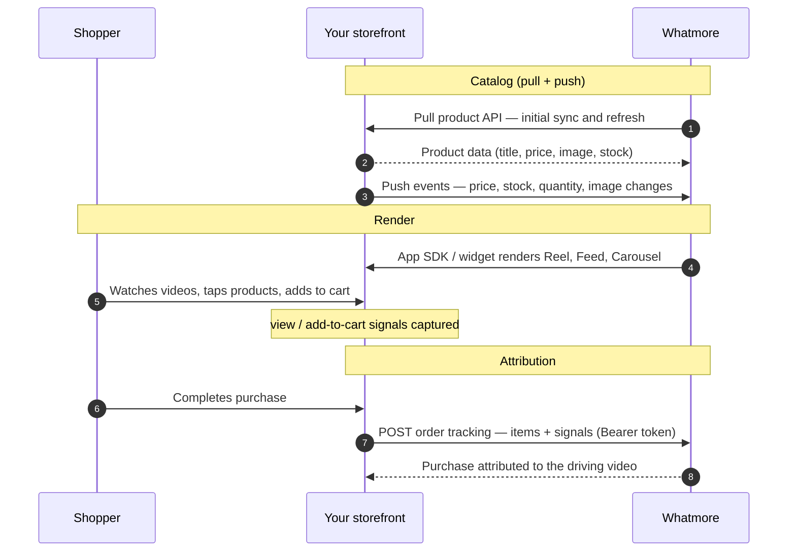

Integrate Whatmore's shoppable-video platform into **any** storefront —
native mobile apps, custom / headless sites, and the major commerce platforms. This section
is the technical reference for that integration.

Whatmore's dashboard does the heavy lifting — video hosting, product tagging, campaigns, and
analytics all live there. Your integration is deliberately small, so you go live fast.

## Platform support

| Platform | How you integrate |
| -------- | ----------------- |
| **[Shopify](/integrations/platform-shopify)** | Install the native app — no code |
| **[Magento / Adobe Commerce](/integrations/platform-magento)** | Web widget + Core APIs |
| **[Salesforce Commerce Cloud](/integrations/platform-sfcc)** | Web widget + Core APIs |
| **[WooCommerce](/integrations/platform-woocommerce)** | Web widget + Core APIs |
| **[BigCommerce](/integrations/platform-bigcommerce)** | Web widget + Core APIs |
| **[Custom / headless](/integrations/platform-custom)** | Web widget + Core APIs (or [App SDK](/integrations/app-sdk) for apps) |
| **Mobile apps** | [iOS](/integrations/sdk-ios) · [React Native](/integrations/sdk-react-native) · [Android](/integrations/sdk-android) |

## The integration surface

Regardless of platform, an integration is made of three building blocks — you can build them
in parallel:

| Building block | What it does |
| -------------- | ------------ |
| **[App SDK / web widget](/integrations/app-sdk)** | Renders the shoppable-video surfaces in your app or site |
| **[Catalog](/integrations/catalog-api)** | Makes your products available to Whatmore (connect your product API in the dashboard, or push via API) |
| **[Order Tracking](/integrations/order-tracking)** | Reports purchases so Whatmore can attribute them to videos |

Everything else — uploading videos, tagging products to them, building campaigns, viewing
analytics — happens in the **[Whatmore dashboard](https://dashboard.whatmore.live/)**, not in your code.

## How data flows

Catalog data flows **into** Whatmore — Whatmore pulls your catalog for the initial load and
refreshes, **and** you push event-based updates (price, stock, images) as they change.
Whatmore then renders the shoppable surfaces **inside** your app, and your order backend
reports purchases **back** for attribution. All API calls are authenticated with a
[bearer token](/integrations/authentication).

## Key concepts

- **`store_id`** — your store's identifier on Whatmore; used to get an access token and on
  every API call.
- **`client_product_id`** — *your* product identifier (commonly the product URL). You
  reference products by it on every call, so Whatmore stays aligned with your catalog
  without a separate mapping layer.
- **Attribution is per order item** — video-view / add-to-cart signals are matched to
  individual line items, so one order can attribute different items to different videos (or
  none).

## Start here

1. **[Getting Started](/integrations/getting-started)** — access token, `store_id`, checklist
2. **[App SDK](/integrations/app-sdk)** — mobile ([iOS](/integrations/sdk-ios) · [React Native](/integrations/sdk-react-native) · [Android](/integrations/sdk-android)) or web widget
3. **Core APIs** — [Authentication](/integrations/authentication) · [Catalog API](/integrations/catalog-api) · [Order Tracking](/integrations/order-tracking)
4. **Your platform** — [Shopify](/integrations/platform-shopify) · [Magento](/integrations/platform-magento) · [SFCC](/integrations/platform-sfcc) · [WooCommerce](/integrations/platform-woocommerce) · [BigCommerce](/integrations/platform-bigcommerce) · [Custom / Headless](/integrations/platform-custom)
